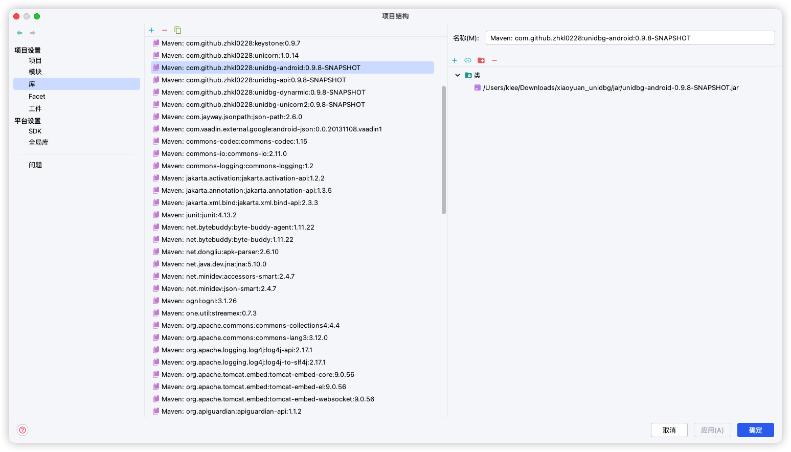
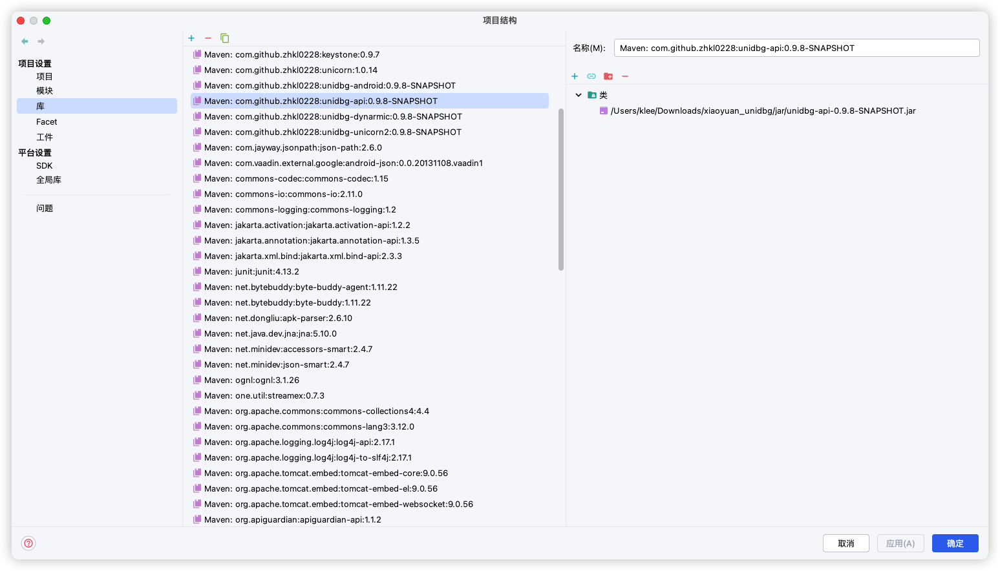
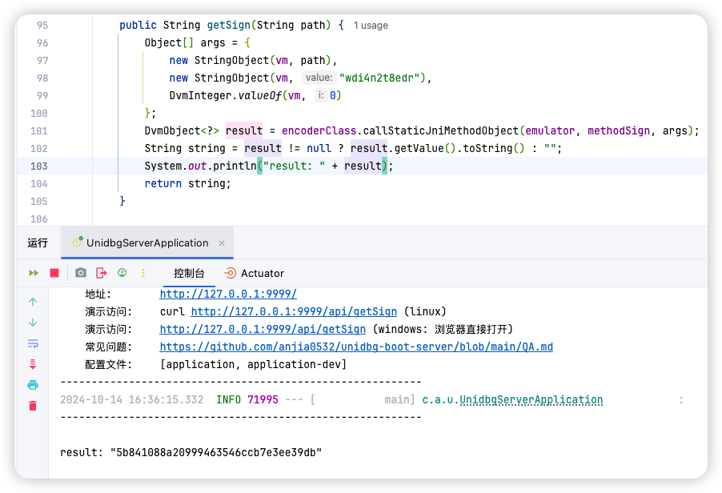

# 基于 Unidbg 和 Unidbg-Boot-Server 生成小猿口算 Sign 的项目

## 使用方法

1. 下载项目
2. 修改依赖的路径
    - 将依赖的路径修改为以下 JAR 包的位置
        - [jar/unidbg-api-0.9.8-SNAPSHOT.jar](jar/unidbg-api-0.9.8-SNAPSHOT.jar)
        - [jar/unidbg-android-0.9.8-SNAPSHOT.jar](jar/unidbg-android-0.9.8-SNAPSHOT.jar)
    - 如图所示
        - 
        - 
3. 同步 Maven
    - 在项目的右侧点击Maven同步按钮
4. Run!

## 进度

- 当前项目已经完成小猿口算的 Sign 生成, 但**未经测试**
    - 

## 感谢

- [unidbg](https://github.com/zhkl0228/unidbg)
- [unidbg-boot-server](https://github.com/anjia0532/unidbg-boot-server)
- [大猿搜题 sign so 加密参数分析](https://mp.weixin.qq.com/s?__biz=Mzg2NjcxNzE3NQ==&mid=2247483906&idx=1&sn=712447f635fb957b0f7d47d7333b865a&chksm=ce47de9af930578c2c3e4181b64de465be78bcc9096731eb6f3eb599768e69f70755bb3bff2e&mpshare=1&scene=1&srcid=0302EmxYsDsZprkUyCAuJRqP&sharer_sharetime=1646203747659&sharer_shareid=56da189f782ce62249ab4f6494feca50&version=3.1.20.90367&platform=mac#rd)
